# Nursing Exam System — Design Diagrams

---

## 1. ER Diagram

```mermaid
%%{init: {'theme': 'base', 'themeVariables': { 'primaryColor':'#e0f2fe','primaryTextColor':'#0c4a6e','primaryBorderColor':'#0284c7','lineColor':'#0284c7','secondaryColor':'#fef3c7','tertiaryColor':'#fdf2f8'}}}%%
erDiagram
    profiles ||--o{ exams : creates
    profiles ||--o{ exam_attempts : attempts
    profiles ||--o{ community_posts : writes
    profiles ||--o{ community_comments : writes
    profiles ||--o{ community_likes : likes
    profiles ||--o| satisfaction_responses : submits

    exams ||--o{ questions : contains
    exams ||--o{ exam_attempts : has

    exam_attempts ||--o{ user_answers : records

    questions ||--o{ user_answers : answered_as

    community_posts ||--o{ community_comments : has
    community_posts ||--o{ community_likes : receives

    satisfaction_responses ||--o{ satisfaction_scores : rates
    satisfaction_questions ||--o{ satisfaction_scores : scored_as

    profiles {
        uuid id PK "##"
        text email UK
        text password_hash
        text name
        text avatar_url
        text university
        text role "student | admin"
    }

    exams {
        uuid id PK "##"
        text title
        text description
        int time_limit_minutes
        bool is_published
        uuid created_by FK
    }

    questions {
        uuid id PK "##"
        uuid exam_id FK
        text question_text
        jsonb options
        text correct_option
        text explanation_text
        int sort_order
    }

    exam_attempts {
        uuid id PK "##"
        uuid user_id FK
        uuid exam_id FK
        int score
        int total_questions
        int time_spent_seconds
        timestamp completed_at
    }

    user_answers {
        uuid id PK "##"
        uuid attempt_id FK
        uuid question_id FK
        text selected_option
        bool is_correct
        timestamp answered_at
    }

    community_posts {
        uuid id PK "##"
        uuid user_id FK
        text title
        text content
        text category
    }

    community_comments {
        uuid id PK "##"
        uuid post_id FK
        uuid user_id FK
        text content
    }

    community_likes {
        uuid id PK "##"
        uuid post_id FK
        uuid user_id FK
    }

    satisfaction_questions {
        uuid id PK "##"
        text question_text
        int sort_order
        bool is_active
    }

    satisfaction_responses {
        uuid id PK "##"
        uuid user_id FK_UK
        text feedback
    }

    satisfaction_scores {
        uuid id PK "##"
        uuid response_id FK
        uuid question_id FK
        int score "1-5"
    }
```

---

## 2. Data Flow Diagram

### Level 0 — Context

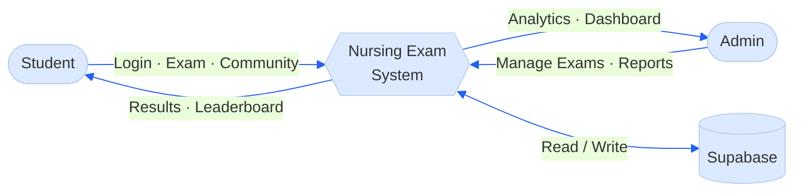

### Level 1 — System Overview

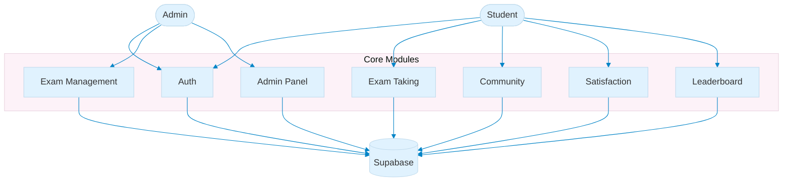

### Level 2 — Exam Taking

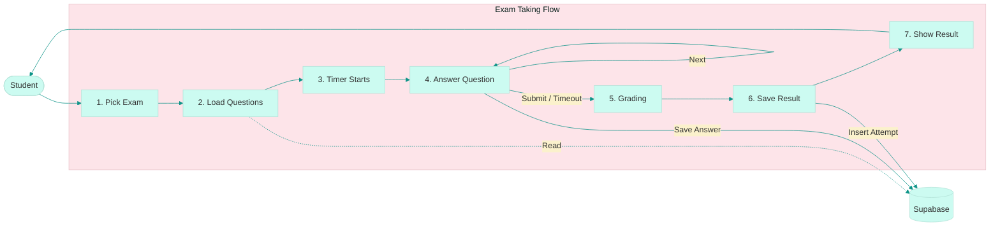

---

## 3. Use Case Diagram

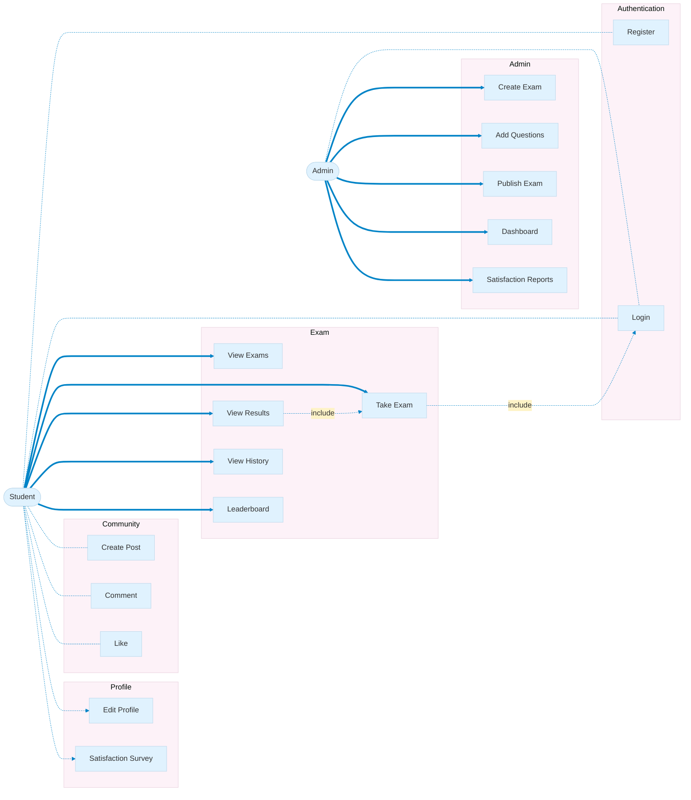

### Summary

| # | Use Case      |  Actor  |                                      |
| :-: | ------------- | :-----: | ------------------------------------ |
| 1 | Register      | Student | สมัครสมาชิก               |
| 2 | Login         |  Both  | เข้าสู่ระบบ               |
| 3 | View Exams    | Student | ดูรายการข้อสอบ         |
| 4 | Take Exam     | Student | ทำข้อสอบ (Timer)             |
| 5 | View Results  | Student | ดูคะแนน + เฉลย            |
| 6 | View History  | Student | ประวัติการสอบ           |
| 7 | Leaderboard   | Student | อันดับคะแนน               |
| 8 | Create Post   | Student | สร้างกระทู้               |
| 9 | Comment       | Student | แสดงความคิดเห็น       |
| 10 | Like          | Student | ถูกใจโพสต์                 |
| 11 | Edit Profile  | Student | แก้ไขโปรไฟล์             |
| 12 | Survey        | Student | ประเมินความพึงพอใจ |
| 20 | Create Exam   |  Admin  | สร้างข้อสอบ               |
| 21 | Add Questions |  Admin  | เพิ่มคำถาม                 |
| 22 | Publish       |  Admin  | เผยแพร่ข้อสอบ           |
| 23 | Dashboard     |  Admin  | ดูสถิติ                       |
| 24 | Reports       |  Admin  | รายงานประเมิน           |

---

## 4. Sequence Diagrams

### 4.1 Login

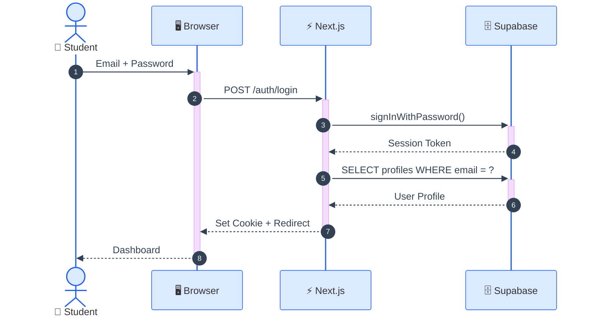

### 4.2 Take Exam

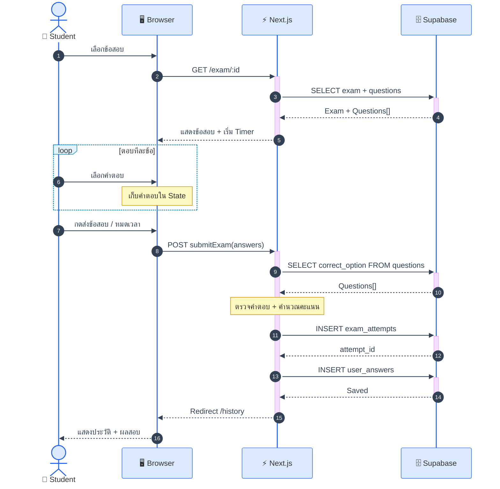

### 4.3 Admin — Create Exam

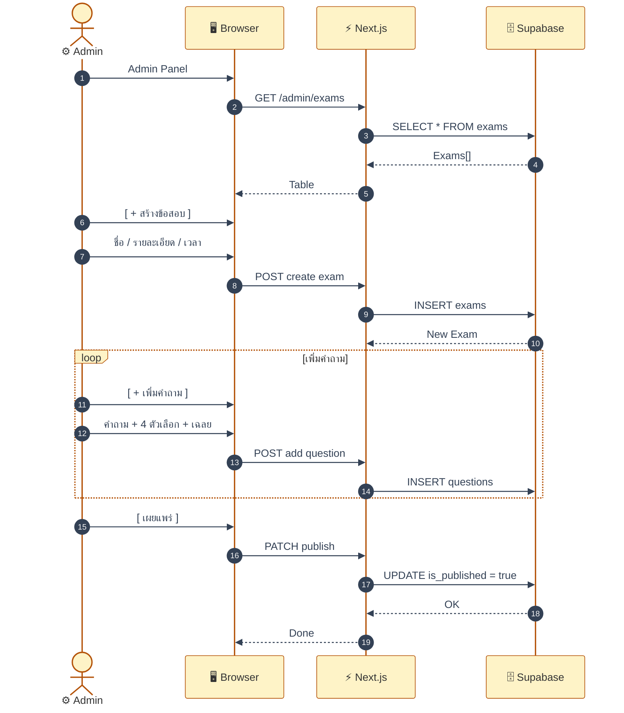

### 4.4 Community

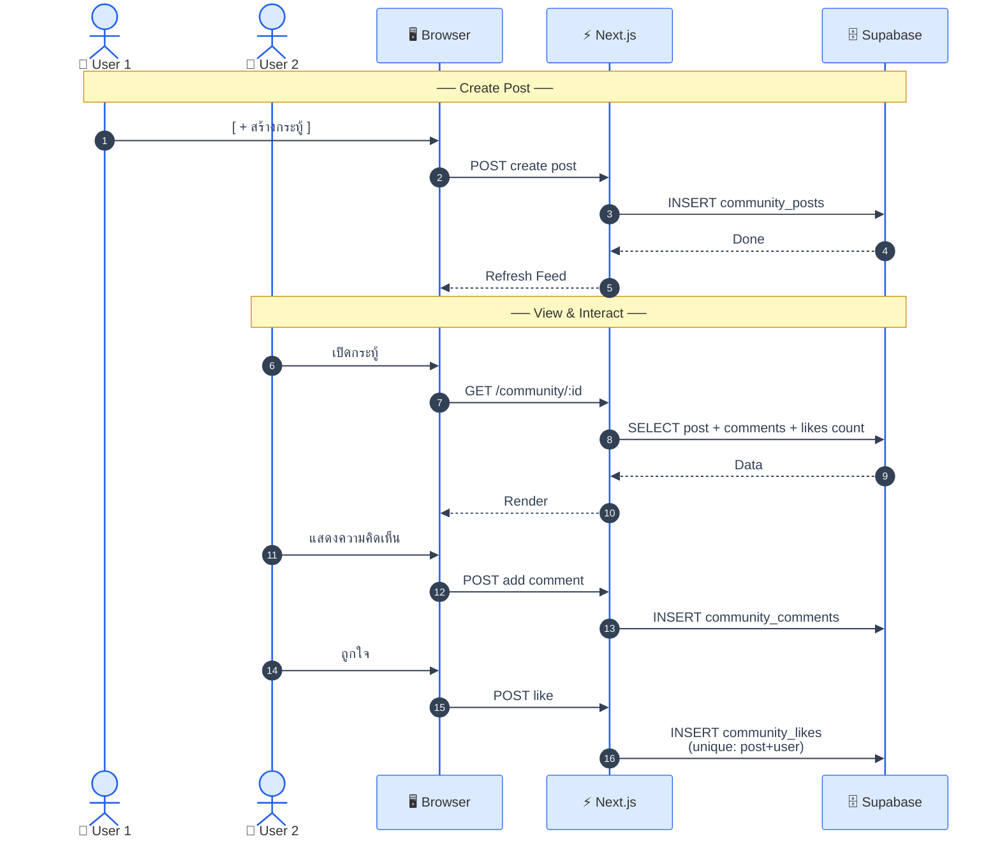

### 4.5 Satisfaction Survey

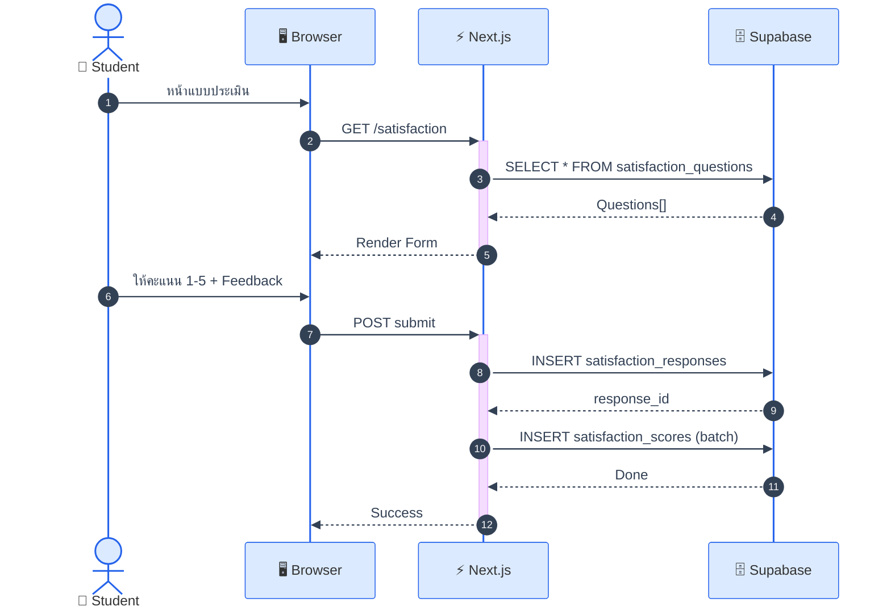

### 4.6 Leaderboard

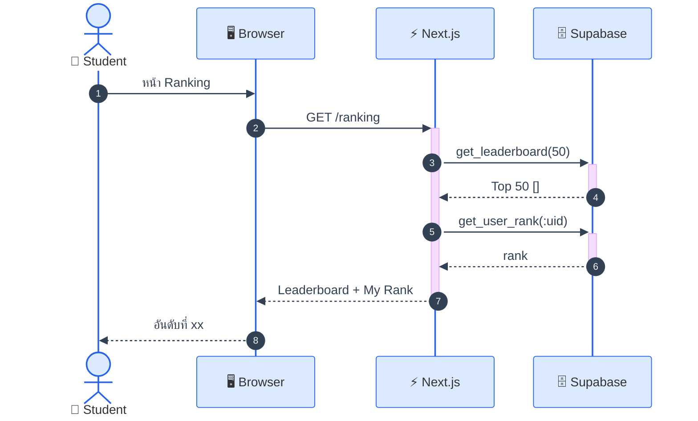

---

## 5. Tech Stack

| Layer      | Tech                       |
| :--------- | :------------------------- |
| Framework  | Next.js 16 (App Router)    |
| Language   | TypeScript                 |
| UI         | React 19 + Tailwind CSS v4 |
| Components | shadcn/ui + Base UI        |
| Backend    | Server Actions             |
| Database   | Supabase PostgreSQL        |
| Auth       | Supabase Auth + bcryptjs   |
| Charts     | Recharts                   |
| Animation  | Framer Motion              |
| Icons      | Lucide React               |

### Routes

| Path                             | Page           |  Auth  |
| :------------------------------- | :------------- | :-----: |
| `/`                            | Landing        |   —   |
| `/login`                       | Login          |   —   |
| `/register`                    | Register       |   —   |
| `/exam`                        | Exam List      | Student |
| `/exam/:id`                    | Take Exam      | Student |
| `/exam/:id/result/:aid`        | Result         | Student |
| `/dashboard`                   | Home           | Student |
| `/history`                     | Exam History   | Student |
| `/ranking`                     | Leaderboard    | Student |
| `/community`                   | Posts Feed     | Student |
| `/community/:id`               | Post Detail    | Student |
| `/profile`                     | Edit Profile   | Student |
| `/satisfaction`                | Survey         | Student |
| `/admin`                       | Dashboard      |  Admin  |
| `/admin/exams`                 | Manage Exams   |  Admin  |
| `/admin/exams/:id`             | Edit Exam      |  Admin  |
| `/admin/satisfaction`          | Survey Reports |  Admin  |
| `/admin/satisfaction/analysis` | Analysis       |  Admin  |

---

## 6. System Architecture Diagram

### 6.1 Simple 3-Tier Architecture

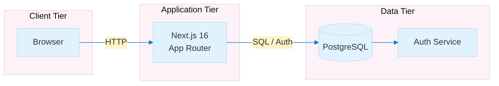

### 6.2 Request Flow

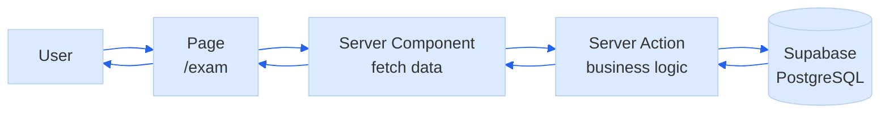

### 6.3 Auth Flow

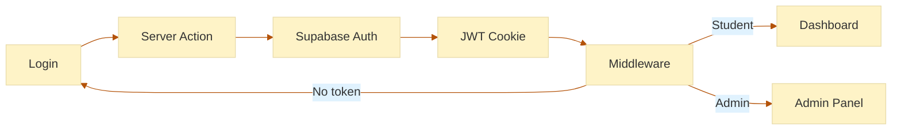

---

## 7. Directory Structure

```
nursing-exam/
├── src/
│   ├── app/                      # Next.js App Router
│   │   ├── (auth)/               # Auth routes (no sidebar)
│   │   │   ├── login/
│   │   │   └── register/
│   │   ├── (dashboard)/          # Student routes (with sidebar)
│   │   │   ├── dashboard/
│   │   │   ├── history/
│   │   │   ├── ranking/
│   │   │   ├── community/
│   │   │   ├── profile/
│   │   │   └── satisfaction/
│   │   ├── admin/                # Admin routes
│   │   │   ├── dashboard/
│   │   │   ├── exams/
│   │   │   └── satisfaction/
│   │   ├── exam/                 # Exam taking
│   │   └── page.tsx              # Landing page
│   ├── actions/                  # Server Actions (Business Logic)
│   │   ├── auth.ts               # Login, Register, Logout
│   │   ├── exam.ts               # Exam CRUD, Submit
│   │   ├── community.ts          # Posts, Comments, Likes
│   │   ├── profile.ts            # Profile updates
│   │   ├── satisfaction.ts       # Survey submission
│   │   └── admin.ts              # Admin operations
│   ├── components/               # React Components
│   ├── context/                  # React Context (Auth)
│   ├── hooks/                    # Custom Hooks
│   ├── lib/                      # Utilities
│   │   ├── supabase-client.ts    # Browser Supabase client
│   │   ├── supabase-server.ts    # Server Supabase client
│   │   └── auth.ts               # Auth helpers
│   ├── types/                    # TypeScript types
│   └── styles/                   # Global styles
├── supabase/                     # Supabase config
├── schema.sql                    # Database schema
└── public/                       # Static assets
```
